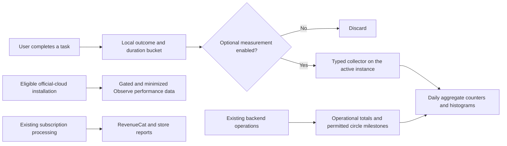

# Analytics that fit Beisammen

Research and implementation proposal · 9 September 2026

**Current implementation scope:** the follow-up decision is to enhance EAS Observe for errors and performance only. See [the monitoring implementation notes](observability.md). The wider research and proposed phases below remain options for later; no Convex product analytics are being added now.

**Research recommendation: start with small, first-party aggregate analytics in Convex, retain EAS Observe only after tightening its privacy controls, and use the existing RevenueCat and store dashboards.** Measure whether people can share, open, and recover their memories, and whether the service can support them sustainably.

Beisammen does not currently need a general behavioral analytics platform. A small set of task outcomes will answer its immediate product questions without creating a history of each person's activity. If maintaining the reporting becomes burdensome, TelemetryDeck is the managed alternative I would evaluate first. Aptabase is worth considering for a deployment you operate, but its current cloud privacy policy needs clarification before adoption.

This proposal is based on the repository, installed dependencies, current vendor documentation, and selected SDK source. No production analytics, live network captures, vendor account settings, or actual user counts were inspected. Cost examples and delivery estimates below are planning assumptions, not observed usage. This document proposes changes; it does not enable collection.

## 1. What the app's ethos means for measurement

The [website's manifesto and promises](../apps/website/src/i18n/ui.ts) describe a quiet place for private circles, encrypted photos, no followers, and no optimization for engagement. The [architecture](architecture.md) also gives people a choice of official hosting or their own instance.

Those commitments suggest four questions:

1. **Can people do what they came to do?** Join their circle, share something, see it, and leave the app satisfied.
2. **Can they trust it with their memories?** Uploads, playback, encryption, recovery, and deletion must work reliably.
3. **Does it remain useful over time?** A family returning after a month can be a success. Daily use is not required.
4. **Can the service continue to exist?** Subscriptions should cover infrastructure and maintenance without monetizing private behavior.

Every measurement should have a named decision it informs. For example, an increase in video upload failures should lead to investigating compression or transport. A lower session duration might mean sharing became easier.

Do not use time spent, daily streaks, notification opens, reaction counts, or invitation volume as optimization targets. Do not collect photo subjects, captions, comments, search text, locations, social graphs, or individual viewing histories for analytics. Avoid session replay, screenshots, touch autocapture, advertising identifiers, fingerprinting, and joining website visits to app accounts. These are product design choices grounded in Beisammen's promises.

## 2. What already exists

| Repository evidence | What it means for this plan |
| --- | --- |
| [Mobile dependencies](../apps/mobile/package.json): Expo 57, React Native 0.86.2, Clerk, Convex, RevenueCat, and `expo-observe` | Build around the existing stack. Any additional native SDK needs validation against these versions. |
| [Root layout](../apps/mobile/src/app/_layout.tsx): `Observe.configure`, Expo Router integration, and `ObserveRoot.wrap` | Performance telemetry is already wired in; this is not a blank-slate installation. |
| [Interactive marker](../apps/mobile/src/features/observe/interactive.tsx) | The app already waits for screen readiness and the animated splash before reporting interactivity. Preserve that intent. |
| [Instance provider](../apps/mobile/src/features/instances/instance-provider.tsx) restores the saved instance asynchronously | Observe is configured before the app knows whether the user selected self-hosting. I found no app-level consent or instance gate for Observe. |
| [Privacy policy](../apps/website/src/pages/PrivacyPage.tsx) names Observe and navigation filtering | Update the policy to describe actual choices, identifiers, purposes, and retention. Disclosure alone is not a consent mechanism. |
| [Logger](../apps/mobile/src/lib/logger.ts) writes to the console; [diagnostics](../apps/mobile/src/features/diagnostics/buffer.ts) retains 50 entries in memory | Useful support tools already exist. Neither is a suitable unsanitized input to a remote analytics or crash service. |
| [Schema](../convex/schema.ts): memberships, published shares, upload state, `circleStats`, billing counters, deletion state | Many important outcomes can be counted where the app already processes them. No external copy of these records is necessary. |

Two findings deserve attention before expanding telemetry:

- **Navigation filtering is narrower than whole-payload filtering.** The root removes selected route parameters. The installed `expo-app-metrics` source also builds a `expo.network.requests.slowestHost` field on iOS and Android. A storage or custom-instance hostname can therefore enter performance metadata independently of route parameters. This is a source-level exposure path, not proof that a production payload has contained one. The current [Expo metrics reference](https://docs.expo.dev/eas/observe/reference/metrics/) also documents network host metadata, although field names differ from the installed version.
- **SDK defaults matter before React renders.** The installed Observe native implementation defaults dispatch to enabled, persists configuration, and treats each `configure` call as a replacement. A later call that omits the gate can restore its default. Startup, persisted queues, background execution, and instance changes need verification in release builds. A settings switch alone is insufficient evidence.

The [E2EE documentation](e2ee.md) explicitly says captions, comments, and reactions remain plaintext for now. Some legacy media and circle covers have separate limitations. Analytics must exclude private content regardless of whether that field is encrypted today. Never decrypt anything for analytics.

## 3. Which analytics are useful, and what they change

| Priority | Measurement | Practical decision | Source and limitation |
| --- | --- | --- | --- |
| P0 | Upload success, failure stage, recovery after interruption | Fix selection, encryption, compression, transfer, or finalization problems | Server state plus optional client outcomes; a completed upload does not establish successful viewing. |
| P0 | Image opening and video first-frame outcomes | Identify unreadable media and playback regressions | Optional on-device outcome after explicit opening; no asset ID or viewing history. |
| P0 | Key bootstrap and recovery outcomes | Improve device migration and access recovery | Fixed success/error categories only; never codes, keys, grants, or cryptographic payloads. |
| P0 | Startup and screen readiness, by release/platform | Catch slow releases and regressions | Gated Observe; compare medians and p90 within comparable populations. |
| P0 | Native crashes and Android app-not-responding reports | Find failures in native media, encryption, and rendering modules | Store diagnostics initially; add a dedicated crash service if their coverage or delay is inadequate. |
| P0 | Account deletion completion and backlog age | Find broken deletion jobs | Backend operational counters; deletion success must survive the client losing its session. |
| P1 | Circle setup and invitation acceptance outcomes | Simplify joining, explain expired links, fix key-grant waiting | Backend milestones and optional task summaries; an invitation created is not necessarily sent or received. |
| P1 | Circles successfully set up for sharing | Understand whether the core experience works | Aggregate membership/publication state; do not equate this with emotional value or confirmed viewing. |
| P1 | Subscription renewals, refunds, billing failures, contribution margin | Keep pricing clear and the service sustainable | RevenueCat, store financial reports, and aggregate infrastructure costs. |
| P2 | Success finding an older memory | Improve navigation and discovery | Voluntary usability sessions first; later a content-free task outcome if a specific question remains. |
| P2 | Store page views, downloads, and listing conversion | Improve screenshots and explain the product better | Store reports; no attribution SDK is needed for this first step. |

RevenueCat already provides subscription charts derived from purchase data; core revenue and renewal reporting does not require inventing matching client events. Treat refunds, expired subscriptions, and disabling auto-renew as different things. Its [charts overview](https://www.revenuecat.com/docs/dashboard-and-metrics/charts), [churn definition](https://www.revenuecat.com/docs/dashboard-and-metrics/charts/churn-chart), and [subscription retention definition](https://www.revenuecat.com/docs/dashboard-and-metrics/charts/subscription-retention-chart) explain those distinctions.

### A small product scorecard

Use a balanced scorecard, with reliability first:

| Metric | Definition for an initial implementation |
| --- | --- |
| Upload attempt success | Successful attempts divided by successful plus failed terminal attempts, from the same observed client population. Report cancellations and start/terminal totals separately; their difference is not an exact abandonment count. |
| Playback success | Explicit media opens that reached an image render or video first frame divided by observed terminal open outcomes. Missing outcomes remain unknown. |
| Circle setup within 14 days | Circles that reached at least two members and their first published share within 14 days of creation, divided by circles whose full 14-day window has elapsed. |
| Circles sharing in 28 days | Current circles with at least two members and at least one published share in the trailing 28 days. This measures publishing activity, not whether everyone saw it. |
| Recovery success | Completed recovery attempts divided by observed terminal recovery attempts, separated by recovery mechanism. |
| Sustainable hosting | Net subscription proceeds minus attributable storage, egress, backend, and service costs, reported monthly. Separate fixed overhead; do not call gross revenue or MRR profit. |

The 14-day and 28-day windows are proposed definitions, not industry benchmarks. Circle setup needs a prospective milestone timestamp; current state cannot reliably reconstruct a past milestone after members leave or content is deleted. Label historical snapshots as snapshots, and begin a trustworthy cohort series after instrumentation ships.

Circle metrics are aggregate processing of existing service metadata, not proof of anonymous collection. Establish and document the basis for that secondary use separately from essential quota/security processing. If that basis is not established, leave the optional circle scorecard disabled; the app does not depend on it.

Do not implement per-person read receipts just to improve the scorecard. Return usage can be explored with aggregate store reports and voluntary conversations before introducing a long-lived analytics identity. [Apple usage reports cover consenting users](https://developer.apple.com/help/app-store-connect-analytics/engagement/app-usage/); their population is not the same as all accounts or your own opt-in sample. [Android vitals](https://developer.android.com/topic/performance/vitals) supplies useful crash and responsiveness signals without adding another app analytics SDK.

## 4. Tool comparison and selection

The ordering below weights data minimization, self-hosting boundaries, fit with the existing app, and maintenance burden more heavily than the size of a free tier.

| Option | Strength | Tradeoff for Beisammen | Decision |
| --- | --- | --- | --- |
| Small Convex aggregates | Uses the existing instance; explicit fields and retention; no new analytics vendor | You maintain a few counters, validators, and reports; no arbitrary historical funnels | **Recommended starting point.** Keep it deliberately small. |
| EAS Observe | Already integrated; startup, route performance, release comparisons, custom events | Persistent installation identifier; automatic metadata; native lifecycle and queue behavior need auditing | **Keep conditionally for reliability**, after the controls below pass. |
| TelemetryDeck | EU-hosted, app-oriented analytics with funnels/retention and documented React Native/Expo support | Recognizes returning users through transformed identifiers; cloud-only; additional provider and integration work | **First managed alternative to evaluate** if aggregate reports become insufficient. |
| Aptabase | Manual event API, available source, EU cloud or own deployment, no long-term SDK user ID | Cloud policy describes daily IP/user-agent-derived identity and up to five years of retention; limited longitudinal analytics | **Do not adopt cloud defaults as-is.** Consider an operated deployment or clarified terms. |
| PostHog EU | Extensive product analysis and a documented Expo integration | More identity, automatic collection, and configuration surface than needed here | Reconsider only for a concrete advanced question the simpler approach cannot answer. |
| Firebase Analytics | Established mobile analytics with collection and advertising controls | Adds infrastructure and advertising-related configuration to an app without that use case | Poor fit for this app's initial needs. |
| Sentry | Dedicated native/JavaScript error investigation and Expo integration | Error context, URLs, console breadcrumbs, and IP handling require deliberate controls | Optional reliability addition, not the product analytics destination. |

**EAS Observe.** Current docs support startup/navigation measurements and user-defined events. Native crash collection is not yet available. JavaScript error reporting is in preview, with limitations including OTA source-map support. Do not interpret an Observe crash-free chart as coverage of native crashes. Sources: [Observe introduction](https://docs.expo.dev/eas/observe/introduction/) and [error reporting](https://docs.expo.dev/eas/observe/errors/).

Its [client ID reference](https://docs.expo.dev/eas/observe/reference/client-id/) explicitly calls the installation identifier pseudonymous and notes that other EAS client libraries share it. Beisammen should never join that ID to Clerk, Convex users, RevenueCat customers, or support identities for routine analytics. Turning off Observe does not automatically remove the separate network behavior of EAS Update.

**TelemetryDeck.** The [React/Expo guide](https://telemetrydeck.com/docs/guides/react-setup/) documents the integration and crypto/TextEncoder requirements. Validate those against Expo 57; do not copy a global crypto replacement into an encryption app. Its [identity design](https://telemetrydeck.com/docs/articles/anonymization-how-it-works/) uses client/server hashing and supports recognizing returning users. That is a meaningful privacy improvement, but a vendor's anonymity claim does not establish that Beisammen's entire payload is anonymous. Use a random analytics-only identifier if longitudinal analysis is ever justified, never email or an account ID. It is [EU-hosted and does not offer self-hosting](https://telemetrydeck.com/docs/articles/hosting-solutions/).

**Aptabase.** Its [homepage](https://aptabase.com/) says it avoids fingerprinting and long-term identifiers, but its [privacy policy](https://aptabase.com/legal/privacy) describes daily identity derived from IP address, user agent, and a rotating salt, with analytics stored for up to five years. This discrepancy is material to this app. The [ingestion source](https://raw.githubusercontent.com/aptabase/aptabase/main/src/Features/Ingestion/EventsController.cs) also derives country/region. Resolve actual cloud behavior and deletion/retention controls before choosing it; do not market it as collecting no identifying signals.

The published React Native package was `0.6.0` when checked, with peer requirements compatible on paper with this app. Source review found manual event collection and `dispose`, but an in-memory event queue without a total queue cap or request cancellation in the inspected dispatcher. `dispose` is not proof that an in-progress flush stops. The environment helper also hardcodes `en-US`, so it should not be used as evidence of users' actual language. These are integration acceptance items, not findings from running it in Beisammen. Sources: [SDK](https://github.com/aptabase/aptabase-react-native), [dispatcher](https://raw.githubusercontent.com/aptabase/aptabase-react-native/main/src/dispatcher.ts), [lifecycle](https://raw.githubusercontent.com/aptabase/aptabase-react-native/main/src/track.ts), and [environment](https://raw.githubusercontent.com/aptabase/aptabase-react-native/main/src/env.ts).

**PostHog.** Its [React Native documentation](https://posthog.com/docs/libraries/react-native) provides an EU endpoint and controls for opt-in, automatic lifecycle capture, GeoIP, replay, and feature-flag requests. If adopted later, disable automatic collection, replay, surveys, push-token capture, and unused flag requests; use a strict event allowlist and no account identification. Omitting `identify()` alone does not eliminate persistent identifiers or automatic properties. The product's broad functionality is useful when needed, but the proposed scorecard does not require it.

**Firebase and Sentry.** Firebase offers [collection, IDFA/IDFV, and advertising controls](https://firebase.google.com/docs/analytics/ios/configure-data-collection); the recommendation against it is about fit, not an assertion that every Firebase configuration sells personal data. For Sentry, the [React Native data inventory](https://docs.sentry.io/platforms/react-native/data-management/data-collected/) describes console breadcrumbs, request URLs/query strings, and backend IP inference. `sendDefaultPii: false` alone would not satisfy this plan. Use the [Expo integration guide](https://docs.expo.dev/guides/using-sentry/) if dedicated crash reporting becomes necessary.

## 5. Proposed integration

### First-party task collection

Create `apps/mobile/src/features/analytics/` with a small event contract, consent store, outcome helpers, and bounded transport. Components call this wrapper; vendor SDKs or arbitrary event objects should not spread through the app.

Compute outcome summaries on the device. A task can report its furthest completed step, result, and duration bucket without exporting its whole sequence of taps. Use the authenticated connection to the active Convex instance. Authentication is for accepting/rate-limiting the request; do not copy the identity into aggregate records or event logs.

On the server, introduce a small `convex/analytics.ts` surface and separate aggregate storage. Validate event names and every property with explicit validators; reject unknown fields, excessive counts, and unexpected enum values. Never accept client user IDs for authorization. Do not print request bodies or validation payloads into logs.

Store daily counters and fixed duration histograms, not raw per-user events. Default reporting dimensions should be platform and an approved release group. Add an OS-major or media-kind breakdown only to a metric that needs it; avoid multiplying every dimension together. Keep any temporary batch deduplication key random, unrelated to identity, and short-lived (24 hours proposed). It is operational metadata with its own expiry, not a user identifier.

Use indexed, bounded queries and paginated jobs. Avoid unbounded scans or `.collect().length`. Place analytics writes separately from shared user/circle documents, and shard counters if observed contention warrants it. Use existing `circleStats` and the published-share time index where applicable. Historical milestone state, if introduced, needs deletion handling and must not become a second copy of circle membership.

This design keeps reporting within the existing application boundary; it does not make Convex an on-device system or establish EU residency. Confirm the actual deployment region, processor terms, and platform log retention. Authenticated submissions are attributable at ingestion even when the application immediately reduces them to aggregate counters.

Do not call a vendor from a Convex query/mutation or allow analytics outages to fail media operations. If external export is introduced later, schedule an action with retries from committed state; export only approved aggregates. Follow the repository's [Convex guidelines](../convex/_generated/ai/guidelines.md) during implementation.

### Instance and consent boundaries

Start disabled while consent and instance configuration are unresolved. Unknown or invalid configuration fails closed. Official telemetry eligibility must use the known official instance identity/origin, not merely a remotely supplied `deployment.kind = cloud` field.

For self-hosted instances, keep all official product telemetry and Observe dispatch off by default. An operator may enable local aggregate reporting with a clear local policy; that is separate from transmitting data to Beisammen's operator. Do not send even a “self-hosted user” event to the official service.

On logout, account deletion, consent withdrawal, or instance switch: stop collection, invalidate pending callbacks, abort requests where possible, discard queued events, and clear local analytics state before activating the next context. Never flush the queue as part of opting out. A request already transmitted cannot be recalled; the guarantee is no newly initiated dispatch after withdrawal. No old-context events may later be sent under a new context.

Use a small memory queue with a concrete cap, such as 50 summaries and a ten-minute maximum age. Batch up to 20 summaries, and bound retries/timeouts. No background task or durable multi-day queue for product analytics. Lose analytics rather than delaying uploads, consuming battery indefinitely, or retaining more private history. Pin and inspect actual SDK/package versions during implementation.

### Observe changes

Centralize Observe configuration so every call supplies the complete gate and intended integrations. The documented [dispatch/sampling controls](https://docs.expo.dev/eas/observe/configuration/) can prevent dispatch; they are not evidence that all on-device collection stops or that every pre-consent record has been discarded.

Verify native startup and cached records before allowing dispatch. Remove private hostnames and unexpected fields before they leave the device; use route templates without route values. The installed public configuration does not expose a general payload scrubber. If sufficient source-side controls are unavailable, leave Observe dispatch disabled while using store diagnostics and explicit first-party timings. Do not pretend a `beforeSend` hook exists or rely on a server filter to prevent a vendor receiving data.

Expo supports a build-time [custom OTLP endpoint](https://docs.expo.dev/eas/observe/configuration/). This is a possible later option for an operated collector, but adds infrastructure and is not a runtime per-instance endpoint switch. It is unnecessary for the first version of this plan.

## 6. Initial event contract

All client events below are optional, omit persistent identity, and go only to the active instance. Record each logical attempt once at its designated boundary; React effects, rerenders, thumbnail prefetching, and retry loops must not manufacture successes.

| Event/summary | Allowed information | Reason |
| --- | --- | --- |
| `onboarding_outcome` | `entry: create/join`, fixed furthest-step enum, result | Find difficulty in circle setup after consent. |
| `invite_join_outcome` | result: joined/expired/revoked/invalid/key_wait/error; duration bucket | Separate broken invitations from access-key delays. |
| `upload_attempt_started` | image/video/live_photo; coarse size bucket | Count observed starts separately from terminal reports. |
| `upload_attempt_finished` | result; fixed failure stage; duration bucket; media kind | Find failures and regressions without exporting file details. |
| `publish_outcome` | success/cancel/error; asset-count bucket | Separate preparing uploads from actually publishing a share. |
| `media_open_outcome` | image/video/live_photo; rendered/key_wait/error; time bucket | Validate usable media after an explicit open. |
| `recovery_outcome` | keychain/recovery_code/reset; result; fixed error category | Improve access recovery without recording secrets. |
| `purchase_restore_outcome` | restored/none/cancel/error; platform | Find restore problems; revenue remains authoritative elsewhere. |
| `notification_setup_outcome` | registered/permission_denied/error | Find broken requested notifications; do not maximize permissions. |

Suggested duration buckets: under 1 second, 1–3, 3–10, 10–30, 30–120, and over 120 seconds. Use an upload-specific scale if needed. Histogram percentiles are approximate; do not display false millisecond precision.

Never allow free-form properties, exception messages, email, names, device names, Clerk/Convex/RevenueCat IDs, circle/share/asset IDs, invite tokens, filenames, URLs, storage hosts, EXIF, GPS, captions, comments, recovery strings, or encrypted key envelopes. Even ciphertext can become an unnecessary correlation handle.

Use backend operational counters for deletion completion, upload finalization, quota failures, notification delivery errors, and billing sync. A push provider accepting a message is not proof that the phone displayed it. Keep technical outcomes distinct from optional product analysis.

Do not join client and server populations to manufacture a funnel. Client success is a device observation; server success is a committed state transition. Count each in its own dashboard with its own denominator. Retries need attempt-level semantics and bounded deduplication; telemetry loss should be reported as uncertainty.

Use server receipt day for aggregate buckets, with a bounded local age check. Starts and finishes can cross a reporting boundary, and either report can be lost. Without retaining attempt-level records, the initial design deliberately cannot calculate an exact abandoned-upload cohort or a cross-device funnel. Use existing upload recovery state to diagnose genuinely stuck uploads, not subtraction of unrelated daily event totals.

## 7. Privacy choices and retention

Provide two independent, initially off choices: **Share technical diagnostics** and **Help improve Beisammen**. Explain their concrete contents and destinations. The first covers optional remote performance/error telemetry; the second covers task outcome analytics. Essential authentication, quota, billing, and security processing continues under its separately documented purposes.

Offer the choice calmly after sign-in, before circle setup, or through Settings → Privacy. Skipping must be as easy as accepting. Do not interrupt recovery, require consent to share photos, or repeatedly ask after refusal. Show a preview of the actual property types. No data collected before agreement should be replayed after agreement.

This leaves a deliberate gap for people who never finish sign-in or never opt in. Use service error totals, device QA, and voluntary usability sessions to investigate those paths. Do not fix sample bias by collecting without permission.

For Germany, [TDDDG §25](https://www.gesetze-im-internet.de/ttdsg/__25.html) addresses storing or accessing information on end-user devices, with specific transmission/strict-necessity exceptions. A claim that an identifier is anonymous does not by itself establish an exception. Separately, GDPR requires a valid basis, purpose limitation, minimization, and retention discipline; see [the regulation](https://eur-lex.europa.eu/legal-content/EN/TXT/PDF/?uri=CELEX%3A32016R0679), especially Articles 5–7 and 25. Opt-in for optional telemetry is the recommended product policy here; obtain legal review of the concrete implementation rather than assuming every diagnostic is either exempt or always consent-only.

Proposed retention limits:

| Data | Proposal |
| --- | --- |
| Optional client queue | Memory only; at most ten minutes and 50 summaries. Purge on boundary changes. |
| Temporary batch deduplication | 24 hours; random keys, no analytics identity. |
| Detailed first-party daily aggregates | 90 days, with limited dimensions. Do not store individual event rows. |
| Coarse monthly aggregates | 13 months for seasonality, after disclosure-risk review. |
| Optional remote diagnostics | Target 30 days. Record the actual vendor-supported period before enabling. |
| Circle milestone state | Minimum needed for the chosen cohort window; delete with the circle and remove expired analytical state. |
| Necessary billing/security records | Separate purpose-specific policy; do not erase statutory records by applying an analytics TTL. |

Observe's [documentation](https://docs.expo.dev/eas/observe/introduction/) states a minimum of 60 days of metric retention. Therefore a universal “we delete diagnostics after 30 days” promise would be inaccurate with that service. Confirm maximum retention, deletion mechanisms, data location, subprocessors, and transfer terms; either document an acceptable exception or keep it disabled. Apply the same check to any replacement.

Small aggregates can still expose people, particularly in two-person circles. Restrict report access, avoid circle-level drilldowns, combine sparse dimensions, and suppress small result cells (for example, fewer than 20 contributing circles where that count is available). Suppression is an additional measure, not proof of anonymity. Event count is not a substitute for contributor count. During an early beta with too few contributors, publish fewer breakdowns and rely on volunteered feedback.

Account deletion must clear attributable analytics state and diagnostic references where retained. Already anonymized totals cannot meaningfully be traced back to an individual; explain that limitation without retaining a re-identification map just to support deletion. Review processor logging/backups as well as the primary tables.

Apple's ATT definition concerns advertising-related cross-company linkage and data brokers; it is not a generic analytics permission. The proposed design should not need ATT if implemented as specified. Still complete accurate [App Store privacy disclosures](https://developer.apple.com/app-store/app-privacy-details/) and [Google Play Data safety disclosures](https://support.google.com/googleplay/android-developer/answer/10787469?hl=en), including SDK behavior. An opt-in switch does not automatically make disclosure optional, and device-linked data is not automatically “not linked.”

## 8. Delivery plan

Estimates assume one engineer familiar with this repository. Allow roughly 7–12 engineering days, followed by several weeks of observation. Native privacy-control work or vendor limitations may expand that estimate.

| Stage | Work | Completion evidence |
| --- | --- | --- |
| 1 · 1–2 days | Inventory emitted Observe fields and native behavior; add shared privacy/instance gating; review local diagnostics sanitization | Release-build captures for fresh install, decline, opt-in, withdrawal, and cloud/self-hosted switching. Disable any telemetry that cannot satisfy the boundary. |
| 2 · 2–3 days | Add small Convex operational aggregates; use RevenueCat/store dashboards; define prospective circle milestones if their processing basis is established | Known synthetic operations produce expected totals; retries, deletion, and scheduled cleanup behave correctly. |
| 3 · 2–3 days | Add the typed optional task summaries, bounded transport, and simple aggregate report | Allowed payloads only; no persistent analytics identity; consent and instance isolation verified. Start with uploads, joining, and recovery. |
| 4 · 1–2 days | Complete bilingual settings/policy copy, retention jobs, dashboard definitions, and release validation | Policy, store declarations, actual payloads, and configured retention agree. No measurable regression in core tasks from telemetry. |
| 5 · Weeks 3–6 | Review failures weekly and usefulness monthly; remove unused measurements | Each retained chart has informed or is tied to a concrete decision. Consider a managed tool only if a recurring question remains unanswered. |

Likely touchpoints are the [root layout](../apps/mobile/src/app/_layout.tsx), [instance provider](../apps/mobile/src/features/instances/instance-provider.tsx), [session provider](../apps/mobile/src/features/auth/session-provider.tsx), [upload flow](../apps/mobile/src/features/media/use-share-upload-flow.ts), [crypto provider](../apps/mobile/src/features/crypto/provider.tsx), [settings](../apps/mobile/src/app/(app)/(tabs)/settings/index.tsx), [schema](../convex/schema.ts), [cron jobs](../convex/crons.ts), [account deletion](../convex/accountDeletion.ts), and [privacy page](../apps/website/src/pages/PrivacyPage.tsx). New analytics modules should own validation and dispatch policy. Follow the existing translation workflow when adding German and English user-facing copy.

Do not expand this into a warehouse, a custom dashboard builder, or a new identity service. Initially, internal bounded queries and a weekly aggregate export are enough. Product analytics collection should be independently disableable without redeploying the rest of the product.

If native crashes remain difficult to diagnose, introduce Sentry as a separate follow-up with replay, screenshots, view hierarchy, automatic console/network breadcrumbs, and unrelated tracing disabled. Verify native and JavaScript payload scrubbing and source maps for both native builds and OTA updates. Route filtering in JavaScript is not sufficient evidence for native crash attachments.

### Verification that matters

- Capture actual network traffic on iOS and Android release builds; debug Observe dispatch is disabled by default and could create a false pass.
- Exercise fresh install, cold launch with previously saved consent, deep-link launch, background/foreground, offline queues, logout, deletion, and instance switches in both directions.
- Use obvious synthetic canaries in a caption, filename, invite token, recovery field, and custom hostname; verify none enters optional telemetry or remote error context.
- Test a denied user and a self-hosted user against all optional telemetry destinations, not just the event wrapper. Distinguish legitimate auth/update/storage traffic from analytics.
- Reconcile synthetic backend transitions and client attempts separately; include retries, cancellations, process termination, key waiting, and purchase restore. A process kill may leave the terminal client outcome unknown.
- Verify batch caps, retry limits, TTL expiry, old-context callback rejection, admin-only aggregate access, and non-blocking behavior when the collector fails.
- Before/after smoke checks should cover startup, photo upload, interrupted upload recovery, video first frame, and encryption/recovery. Measure observed overhead; do not invent a universal performance budget.

## 9. Cost and operational effort

Public prices checked on 9 September 2026; taxes, currency conversion, other products, and existing contracts may differ.

| Option | Verified public allowance or pricing |
| --- | --- |
| First-party Convex aggregates | No additional analytics vendor bill; incremental function calls, writes, storage, and engineering time still cost money. Measure against the current deployment's actual usage. |
| EAS Observe | 100,000 events/month on Free; 500,000 on paid plans, then usage pricing. Includes automatic metrics, not just custom events. [Source](https://docs.expo.dev/eas/observe/introduction/) |
| TelemetryDeck | New accounts receive 50,000 free events/month; pre-July 2026 accounts may retain 100,000. Paid price depends on the current tier/features. Older comparisons quoting 100,000 for everyone are stale. [July 2026 pricing change](https://telemetrydeck.com/blog/pricing-update-2026/) |
| Aptabase Cloud | 20,000 free events/month; $10/month for 200,000; $20/month for 1 million. Stops collection at plan limits rather than charging overages. Privacy-policy questions above still apply. [Pricing](https://aptabase.com/pricing) |
| PostHog | 1 million analytics events/month free. Pricing and retention differ by plan/product; the current free plan advertises one year of retention. [Pricing](https://posthog.com/pricing) |

Illustrative volume: 1,000 monthly active installations × 30% consenting × 8 uses/month × 6 summaries/use = **14,400 task summaries/month**. At 10,000 installations the same assumptions give 144,000. This excludes Observe's automatic events and backend counters. Count summaries per completed workflow, not events per photo or thumbnail render. Actual batch utilization determines Convex mutation volume.

A cheap SDK can still be costly if it requires recurring privacy work or encourages collection that the product does not need. Conversely, a hand-built reporting system can become expensive if its scope expands. Keep the first-party implementation to fixed counters and histograms; reassess managed TelemetryDeck when maintaining reports repeatedly consumes more time than it saves.

## 10. How to use the results

Review reliability after every release: upload failures, unreadable media, recovery failures, crashes, and startup regressions. Review circle setup and subscription sustainability monthly. Always display observation counts and population coverage beside rates.

Start with a baseline rather than arbitrary growth targets. For a small population, one household can move a chart dramatically; show uncertainty and avoid ranking tiny segments. Do not compare opted-in client rates directly with all-account server totals, and do not add distinct daily counts to claim monthly unique users or circles.

Pair measurements with a few voluntary conversations or usability sessions: could someone accept an invitation, share a short video, find a photo from months ago, and recover on another device? Analytics can identify the step that fails; people explain why it feels confusing or intrusive. Use sample media for recorded sessions and explicit permission for any recording.

Experiments should improve understandable invitations, successful uploads, recovery clarity, or performance. At small scale, sequential releases and usability testing are usually more informative than underpowered A/B tests. If testing a change that affects a whole circle, account for members influencing each other rather than treating their outcomes as independent. Keep results temporary and aggregate. Never experiment with weaker encryption, harder cancellation, more pressure to invite others, or more frequent notifications to manufacture engagement.

**The first useful outcome is a weekly report that shows where sharing breaks, whether people can get their memories back, and whether hosting is sustainable—without a dossier of anyone's private life.**
